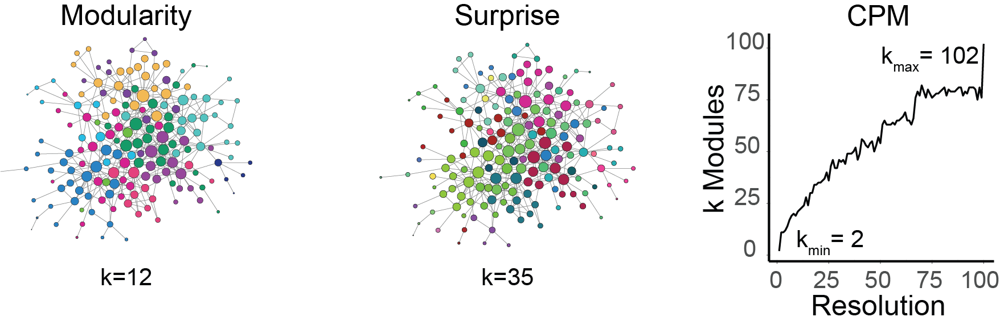

# leiden
_cluster graph(s) with the leiden algorithm_

## Usage

This is a wrapper script around `vtraag's` [Leiden
Algorithm](https://github.com/vtraag/leidenalg)[1]. Put this script in your path,
and then you can call it from anywhere!

```bash

# get a graph
wget https://github.com/twesleyb/leiden/raw/master/data/adjm.zip

unzip adjm.zip && cd adjm/

# cluster the graph with the leiden algorithm and surprise
leiden adjm.csv -q Surprise 

# or try the CPM algorithm
leiden adjm.csv -q CPM -g 1

# NOTE: currently only supports a single resolution!
```


> Clustering of the iPSD protein-protein interaction graph from
> [Uezu2016](https://github.com/soderling-lab/Uezu2016)[2] using three different
> leidenalg methods, Modularity, Surprise, and CPM. The networks are visualized
> using [Cytoscape](https://cytoscape.org/).


## Dependencies

I recommend using a virtual environment such as `conda`. Then insure you have
installed the following python dependencies:
* _leidenalg_ 
* _igraph_
```
conda install -c conda-forge igraph leidenalg
```

## References

__[1]__ From Louvain to Leiden: guaranteeing well-connected communities.   
Traag, V.A., Waltman. L., Van Eck, N.-J. (2018). _Scientific reports_, 9(1), 5233.
[DOI: 10.1038/s41598-019-41695-z](https://www.nature.com/articles/s41598-019-41695-z)

__[2]__ Identification of an Elaborate Complex Mediating Postsynaptic Inhibition.  
Akiyoshi Uezu, Daniel J. Kanak, Tyler W.A. Bradshaw, Erik J. Soderblom, 
Christina M. Catavero, Alain C. Burette, Richard J. Weinberg, and Scott H. Soderling.
_Science_, 2016 Sep 9; 353(6304): 1123–1129. 
[DOI: 10.1126/science.aag0821](https://science.sciencemag.org/node/683771.full)  
